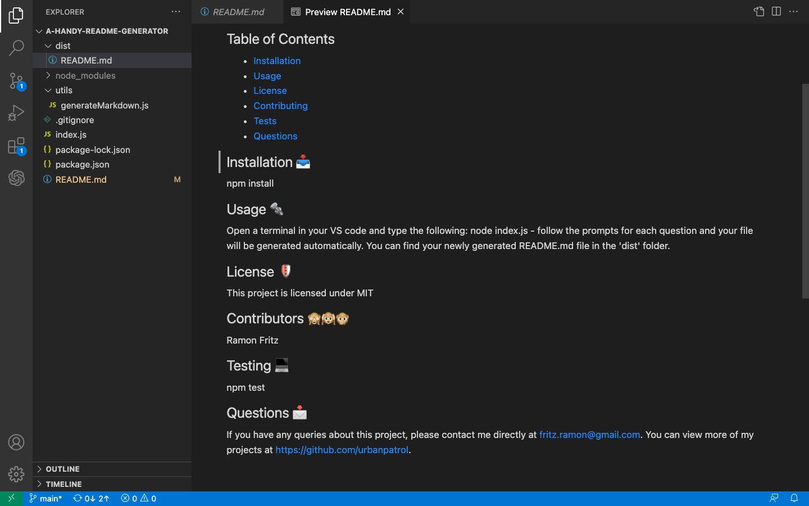
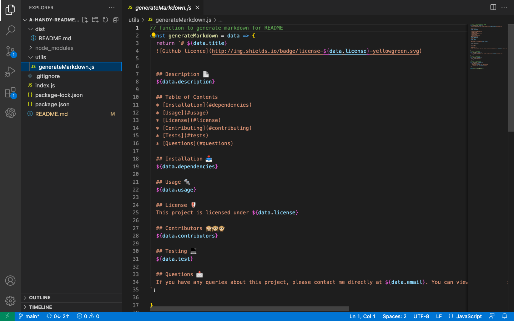
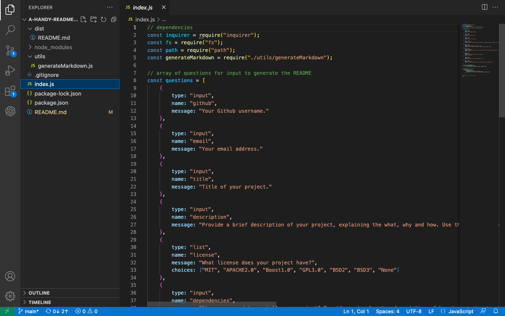

# A Handy README.md Generator

## Description
A Node.js based tool that users can utilise to generate a README.md file for their repo projects.

## Links
### Walkthrough video and sample README file: https://drive.google.com/drive/folders/1aS2Xn6N_-1lu2t-v2O52BRLS1RG4iemJ?usp=share_link

## User Story
```
- AS A developer
- I WANT a README.md file generator
- SO THAT I can quickly create a professional README for a new project
```
## Acceptance Criteria

- Create a command-line application that accepts user input.
- When a user is prompted for information about the application repository, a high-quality, professional README.md is generated with:

- The title of my project  
- Sections entitled:
>- Description
>- Table of Contents
>- Installation
>- Usage
>- License
>- Contributing
>- Tests
>- Questions

## Usage
- This tool will allow the user to create a README.md file by first, opening a new terminal in VS Code and typing node index.js 

Users will be prompted for the following:
- Github username
- Email address
- Title of the project
- A short description of the project
- An associated license if applicable
- Any dependencies
- A list of contributors
- Contacts details for collaboration requests

## Screenshots
Sample generated README file

Markdown to be generated

Questions coding in index.js


## Technologies
- <p><a href="https://nodejs.org/">Node.js</a></p>
- <p><a href="https://www.npmjs.com/">NPM</a></p>
- <p><a href="https://www.npmjs.com/package/inquirer">Inquirer.js</a></p>

## Contributor
Ramon Fritz ©2023 All Rights Reserved.
- - -
